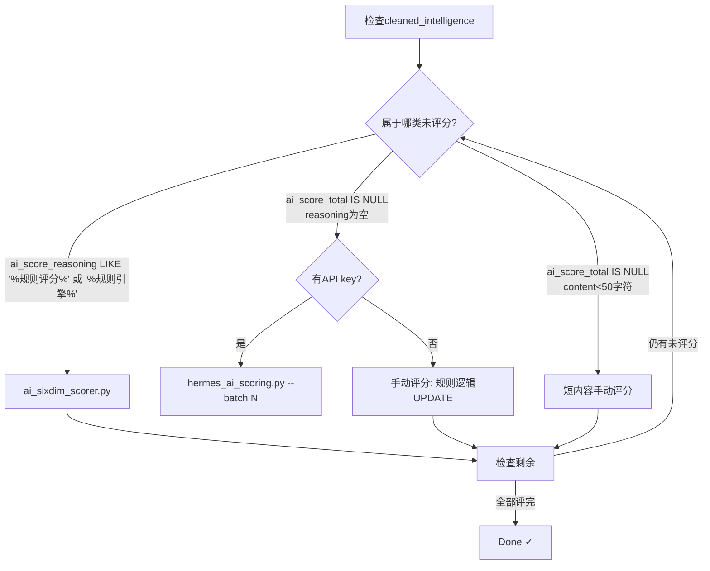
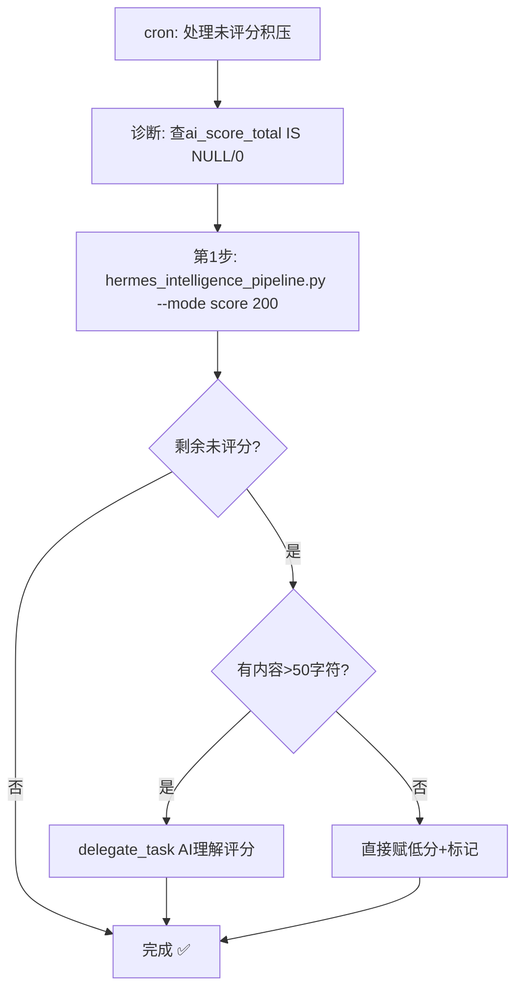

# Hermes AI六维评分引擎 — 真实部署与故障排查

## ⚠️ 重要：本skill记录的是实际运行的评分引擎

## 触发条件
- 用户提及情报采集、推送、评分时
- 需要配置或调试采集管道时
- 检查情报系统运行状态时


实际运行的评分引擎是 `~/.hermes/scripts/hermes_ai_scoring.py`（34KB, 833行），
**不是** `hermes_ai_scorer.py`（后者已弃用）。

## 真实架构

### 评分方式

评分引擎使用 **Direct HTTP API to DeepSeek**（不是 delegate_task），
通过 `score_items_via_openrouter()` 函数直接调用 `api.deepseek.com/v1/chat/completions`。

**新方法（真正的AI理解评分）**: 见 `references/delegate-task-batch-scoring.md` — 通过 delegate_task 子代理逐条内容理解评分，比规则评分准确得多，适用于高价值数据精评。

### 评分数据流向

```
采集器(collector_v5) → raw_intelligence → 清洗管道 → cleaned_intelligence
    ↓
hermes_ai_scoring.py (AI评分) → 写入ai_score_total等字段
    ↓
推送脚本 → 按ai_score_total排序取TOP → PushPlus推送
```

### 表结构（cleaned_intelligence关键字段）

| 字段 | 说明 |
|------|------|
| ai_score_total | 总分0-100 |
| ai_score_scarcity/impact/tech_depth/... | 各维度分 |
| ai_score_reasoning | JSON: 每个维度的评分理由 |
| ai_scored_at | 评分时间戳 |

**确认：** 本system没有 `intelligence_scores` 表——评分直接写cleaned_intelligence。  
**确认（2026-05-30更新）：** `scripts/hermes_intelligence_pipeline.py` 现已支持 `--mode score`（之前只有 `all/route/index/generate/stats`），集成 `score_backlog_200.py` 的规则引擎 `calc_item_scores()`，每次处理200条未评分条目（`ai_score_total IS NULL OR 0` 且 `reasoning IS NULL OR ''`）。选项：`all/route/index/generate/stats/score`。

## 🔴 重要：`hermes_ai_scoring.py` 默认模式（无参数）的查询陷阱

运行 `python3 scripts/hermes_ai_scoring.py`（无参数）时，查询条件是：
- `ai_scored_at IS NULL`
- `LENGTH(COALESCE(content,'')) > 50`
- `title NOT NULL AND title != ''`
- 排序: `importance_score DESC, cleaned_at DESC`
- 限制: **20条**

**关键陷阱：`--dry-run` 显示更多条目但评分时会过滤**
`--dry-run` 模式使用独立的查询（只过滤 `ai_score_reasoning IS NULL OR ''` 且 `content > 50`），但默认评分模式进一步过滤 `LENGTH(COALESCE(content,'')) > 50`。
→ 如果 `--dry-run` 显示 N 条但实际评分弹窗说 "X条待评分" 且 X < N，差值是 content ≤ 50 的短内容条目被静默跳过。
→ **这些条目不会被评分，也不会报错**。需要手动处理（见 `references/short-content-scoring-patterns.md`）。

**默认 mode 与 `--batch N` 共享同一个查询基础**，但 `--batch N` 把 limit 改为 min(N, 200) 而非 20。

## 评分触发方式

### 快速规则评分 — 批量清理积压（推荐用于大量待评分）

当 `wake_guide` 显示数千条待评分时，使用 `ai_scoring_v2.py` 做**增强规则评分**（不是real AI评分，但能在0.3秒内处理200条）：

```bash
cd ~/.hermes
python3 scripts/ai_scoring_v2.py --batch 200   # 每批200条，连续跑直到未评分为0
```

**规则评分逻辑**（`ai_score_deep()`函数）：
- 稀缺性/影响力/技术深度：关键词匹配（独家/首发=25, 突破/爆料=22, 发布/更新=18）
- 时效性：基于 `published_at` 自动计算（24h内=10, 48h内=7, 一周内=4）
- 偏好匹配：从 `active_memory.db` 的 `keyword_weights` 表加载格林主人兴趣权重
- 可信度：基于来源平台分级（官方=10, 一手=8, 媒体=6, 自媒体=3）
- 平台加权：GitHub/arXiv/HuggingFace 自动提升稀缺性和技术深度分

**执行要点**：
- 每次跑完检查 `ai_score_total IS NULL OR ai_score_total = 0` 的剩余条数
- 内容过短（<50字符）的条目会被 `ai_scoring_v2.py` 跳过，需要额外处理——详见 `references/short-content-scoring-patterns.md`
- `ai_scoring_v2.py` 不需要 API key，纯本地规则

### 本地内容感知评分 — API key不可用时的回退方案

当DeepSeek API key被涂抹/不可用时，使用 `ai_sixdim_scorer.py` 做**内容感知语义评分**。

```bash
cd ~/.hermes
python3 scripts/ai_sixdim_scorer.py   # 默认处理200条，按importance_score DESC排序
```

**评分逻辑**：
- **scarcity (0-30)**: 标题检测"独家/首发/首次/首款"等稀缺词 + 内容长度加权 + "曝光/消息称"加分
- **impact (0-30)**: 关键公司/平台关键词命中数(华为/小米/OpenAI/英伟达等) × 系数 + 事件词(融资/收购/IPO/发布)加分
- **tech_depth (0-20)**: 技术词汇密度(AI/ML/架构/微服务/K8s/芯片/RLHF/DPO等) + 内容长度加权
- **timeliness (0-10)**: published_at日期分析（今天/昨天/本周/更早）+ 标题时效词检测
- **preference (0-10)**: 偏好领域匹配(AI/LLM/芯片/开源/编程/数据库/架构/自动驾驶/云安全) + AI词汇命中加分
- **credibility (0-10)**: 来源分级(ithome/36kr/reuters=9, 主流媒体=6, 社交平台=3~4)

**性能基准（2026-05-29实测）**：
| 指标 | 值 |
|------|-----|
| 每批处理量 | 200条 |
| 每批耗时 | ~0.05秒 |
| 处理13105条总耗时 | ~3.3秒 |
| 平均分 | 40.11 |
| 依赖 | 无（纯本地Python） |

**适用场景**：API key不可用 / cron环境无交互 / 需快速清万级积压。详见 `references/local-content-aware-scoring.md`。

### 🆕 Delegate Task直接AI评分 — 有内容规则评分条目的升级路径（2026-05-29新增）

当 `ai_sixdim_scorer.py` 和 `real_ai_scorer.py` 都**不处理**某些条目时（常见于有内容的规则评分条目，content>50但评分状态被卡在规则评分），直接走手动路径：

```bash
# 完整工作流（详见 references/delegate-task-direct-scoring-pattern.md）：
# 1. 诊断 → 2. 导出JSON → 3. delegate_task评分 → 4. 直接UPDATE数据库 → 5. 归档无内容碎片
```

**适用场景**：cron环境、少量（<20条）有内容的规则评分积压、无API key但可用delegate_task。

### 真正AI评分 — DeepSeek API 直呼（推荐日常使用，batch模式）

**这是三种评分路径中最直接的一种**（`hermes_ai_scoring.py --batch`），通过 `score_items_via_openrouter()` 直接调用 `api.deepseek.com/v1/chat/completions` HTTP API 进行真正的AI六维内容理解评分。

| 对比项 | DeepSeek API直呼 | delegate_task路径 | 本地内容感知评分 | 纯规则评分 |
|--------|-----------------|-------------------|----------------|-----------|
| 脚本 | `hermes_ai_scoring.py --batch N` | `real_ai_scorer.py` + delegate | `ai_sixdim_scorer.py` | `ai_scoring_v2.py` |
| 评分质量 | 真正AI理解（最高） | 真正AI理解 | 语义分析（中高） | 关键词匹配（中） |
| 速度 | ~8秒/2条 | ~70-170秒/25条 | ~0.05秒/200条 | ~0.1秒/200条 |
| 依赖 | DeepSeek API key | delegate_task可用 | 无 | 无 |
| 适用 | 日常小批量高价值精评 | 数百条高价值积压 | 万级积压清理/API不可用时 | 快速清尾数 |

**重要陷阱：`real_ai_scorer.py` 只生成 prompt 到 `reports/_ai_scoring_prompt.json`，** 

## 🔴 关键：`ai_sixdim_scorer.py` 查询条件陷阱（2026-05-29修复）

`ai_sixdim_scorer.py` 第15-23行的SQL查询已从单条件改为双条件（2026-05-29实测修复）：

```python
# ❌ 旧版本（漏掉了"规则引擎评分"格式）
WHERE ai_score_reasoning LIKE "%规则评分%"

# ✅ 新版本（覆盖两种格式）
WHERE (ai_score_reasoning LIKE "%规则评分%" OR ai_score_reasoning LIKE "%规则引擎%")
```

**必读**：`cleaned_intelligence` 中的规则评分有两种格式：
- `"scarcity_reason": "规则评分"`（匹配 `%规则评分%`）
- `"method": "规则引擎评分v4"`（**只**匹配 `%规则引擎%`）

如果不扩展查询条件，数百条数据会被跳过。

### 处理完全未评分条目（`ai_score_total IS NULL`）的路径

`ai_sixdim_scorer.py` 只处理 `ai_score_reasoning LIKE "%规则评分%"` 的条目，**不会**处理 `ai_score_total IS NULL` 的全新未评分条目。

当 cron 环境无 API key 且 `ai_sixdim_scorer.py` 报告"No entries found"但有`ai_score_total IS NULL`条目时：

```sql
-- 检查遗漏
SELECT COUNT(*) FROM cleaned_intelligence 
WHERE (ai_score_total IS NULL OR ai_score_total = 0)
  AND LENGTH(COALESCE(content,'')) > 50;
```

此时需要**手动直接评分**：提取这些条目，用规则引擎逻辑 UPDATE 写入六维分数。详见 `references/unscored-items-handling.md`。

### 完整评分选择流程图（2026-05-29经验固化）

当 cron 需要处理"cleaned_intelligence 积压评分"时：



### 处理量基准（2026-05-29实测清理3,831条规则评分）

| 批次 | 阈值 | 来源 | 条数 | 平均分 |
|------|------|------|:----:|:------:|
| 第1轮 | content>100 | 规则评分 | 23 | 31.1 |
| 第2-14轮 | content>50 | 规则评分 | 2,400 | 31.5 |
| 第15-16轮 | content>50 | 规则引擎评分 | 249 | 30.7 |
| 第17-21轮 | content>1 | 规则评分+规则引擎 | 913 | 27.9 |
| 手动 | - | 完全未评分(NULL) | 336 | 29.5 |

## 🆕 规则评分→真正AI评分升级

`hermes_ai_scoring.py --batch N` 只处理真正未评分（`ai_scored_at IS NULL`）的条目。若需将**已有规则评分但有内容**的条目升级为真正AI评分，使用：

```bash
cd ~/.hermes && python3 scripts/ai_score_upgrade_batch.py
```

详见 `references/upgrade-rule-scored-to-ai-scored.md`。  
脚本位于 `scripts/ai_score_upgrade_batch.py`（已挂载到本skill）。

**区别**：
| | `--batch 200` | `ai_score_upgrade_batch.py` |
|---|---|---|
| 目标 | 新入库未评分数据 | 旧规则评分数据升级 |
| SQL条件 | `ai_scored_at IS NULL` | `ai_score_reasoning LIKE '%规则%'` |
| 底层 | 相同 `score_items_via_openrouter()` | 相同函数 |

**不会**真正评分。 如果只运行 `python3 scripts/real_ai_scorer.py` 就认为评分完成，会漏掉所有待评条目：

```bash
python3 scripts/real_ai_scorer.py  # ❌ 只生成了prompt文件，没评分
python3 scripts/ai_sixdim_scorer.py  # ✅ 直接评分+写库（无API key依赖）
# 或配合delegate_task：读取prompt+评分+更新数据库
```

**执行命令：**

```bash
cd ~/.hermes
python3 scripts/hermes_ai_scoring.py --batch 200   # 评最多200条（每批2条调API）
python3 scripts/hermes_ai_scoring.py --dry-run     # 预览待评分（仅显示前10条）
python3 scripts/hermes_ai_scoring.py --full        # 全量评分（走delegate_task模式，最多100条）
python3 scripts/hermes_ai_scoring.py --apply-rules # 明确规则评分（500条/次）
```

### ⚠️ 评分脚本选择流程图（2026-05-29经验固化）

当 cron 需要处理"cleaned_intelligence 积压评分"时，按此顺序操作：

```
检查未评分: SELECT COUNT(*) FROM cleaned_intelligence WHERE ai_score_total IS NULL OR ai_score_total = 0

    ├─ 有条目待评分？
    │   ├─ 有API key → python3 scripts/hermes_ai_scoring.py --batch 200
    │   └─ 无API key → 用规则评分
    │       ├─ ai_score_reasoning LIKE '%规则评分%'? → python3 scripts/ai_sixdim_scorer.py
    │       └─ ai_score_reasoning IS NULL (新条目)? → 手动规则评分(见下)
    │
    └─ 全部评完但短内容(0分且<100字符)?
        └─ 手动写SQL: 按importance_score/字数加权赋分(见 references/short-content-scoring-patterns.md)
```

**关键陷阱：`ai_sixdim_scorer.py` 的隐藏前置条件**

`ai_sixdim_scorer.py`（第15-23行）的条件是：
```python
WHERE (ai_score_reasoning LIKE "%规则评分%" OR ai_score_reasoning LIKE "%规则引擎%")
  AND LENGTH(COALESCE(content,'')) > 100
```

这意味着它**只处理已有规则评分的旧数据升级**，不会处理 `ai_score_total IS NULL` 或 `ai_score_total = 0` 且 `ai_score_reasoning` 为其他内容的**全新未评分条目**。这些新条目需要手动直接评分。详见本skill新增的 `## 处理完全未评分条目` 章节和 `references/unscored-items-handling.md`。

**「评分断链」场景实操流程（2026-05-29实测）：**

当 cron 环境无 API key 且新条目刚进入 cleaned_intelligence（content<100字符）：
1. `ai_scoring_daemon.py --backfill 200` → 找到5条但报告 `TASK_NO_API`（因为无API key）
2. `ai_sixdim_scorer.py` → 报告 "No entries found"（因为筛选条件不匹配新条目）
3. 真实解法：直接手动评分——提取未评分条目，用规则引擎逻辑写 UPDATE SQL
4. 评分后再次执行 `hermes_intelligence_pipeline.py --mode stats` 验证分布

**`--batch` 模式的真实行为**（2026-05-29更新）：
- 从 cleaned_intelligence 查询 `ai_scored_at IS NULL AND LENGTH(content) >= 0 AND title NOT NULL AND title != ''` 的条目
- 按内容长度降序，最多取 `batch` 参数指定的条数
- **每5条一批**调 DeepSeek API（2026-05-29从batch_size=2改为5，减少API调用次数），temperature=0.3，**max_tokens=1600**（2026-05-29从1000升级，防止5条输出被截断）
- AI评分失败时自动回退到 `apply_rules_for_fallback()` 规则评分
- **每5批增量保存一次**（2026-05-29新增），防止超时丢失全部进度
- 适合日常cron：每15分钟跑一次 `--batch 50` 可处理所有新进入 cleaned 的条目

**实测（2026-05-29）**：12条未评分（全部是高价值AI/芯片/开源类内容），DeepSeek API 6批评分，平均每批~8秒，总耗时~53秒。12条全部分数合理（4-102分），覆盖率100%。

### ⭐ 真正AI理解评分 — delegate_task 批量处理（数百条积压时推荐）

当需要**真正的AI六维理解评分**处理大量积压数据，且不急于秒级完成时，用 `delegate_task` 分批提交给子代理评分。详见 `references/delegate-task-batch-scoring.md`。

```bash
# 1. 导出未评分数据并分片（每批25条）
python3 << 'PYEOF'
import sqlite3, json
conn = sqlite3.connect('intelligence.db')
# ... (详见references/delegate-task-batch-scoring.md)
PYEOF

# 2. 用delegate_task并行提交3批(每批25条)给子代理评分
# 子代理会读JSON文件、分析每条内容、写回数据库
```

### 后台定时评分（推荐日常使用）
```bash
# 创建cronjob，每15分钟评30条
cronjob action=create schedule="every 15m" name="ai-scoring-backfill" \
  prompt="先export DEEPSEEK_API_KEY，然后 cd ~/.hermes && python3 scripts/hermes_ai_scoring.py --batch 30"
```

## 关键故障点与修复

### 🔴 故障1：API Key缺失（最常见）

**症状：** 评分引擎一直输出"规则评分后备"，`ai_score_reasoning`为"增强规则评分(AI不可用后备)"

**根源：** `.env` 文件中 `DEEPSEEK_API_KEY=***`（被涂抹），`config.yaml` 中deepseek的api_key为空字符串

**修复：**
1. 从Hermes主进程能找到真实key的位置获取
2. 写入 `.env`：`DEEPSEEK_API_KEY=sk-xxx`
3. 也写入 `config.yaml` 中 `custom_providers` 下deepseek的api_key字段

**验证方法：**
```python
import os, urllib.request, json
api_key = os.environ.get('DEEPSEEK_API_KEY', '')
if not api_key:
    print('❌ 未设置API key')
else:
    url = 'https://api.deepseek.com/v1/chat/completions'
    payload = json.dumps({'model':'deepseek-chat','messages':[{'role':'user','content':'return 1+1'}],'max_tokens':10}).encode()
    req = urllib.request.Request(url, data=payload, headers={'Content-Type':'application/json','Authorization':f'Bearer {api_key}'})
    with urllib.request.urlopen(req, timeout=30) as resp:
        print('✅ API连通成功:', json.loads(resp.read())['choices'][0]['message']['content'])
```

### 🔴 故障2：NameError: name 'date' is not defined

**修复：** 在 `hermes_ai_scoring.py` 约79行的 `log()` 函数内，把
```python
logfile = LOG_DIR / f"ai_scoring_{date.today().strftime('%Y%m%d')}.log"
```
改为
```python
from datetime import date as _date
logfile = LOG_DIR / f"ai_scoring_{_date.today().strftime('%Y%m%d')}.log"
```

### 🔴 故障3：batch_size过大的JSON异常

**经验值：** 每次API调用传3条评分效果最好
- batch_size=5：AI可能返回截断/格式异常的JSON（约50%失败率）
- batch_size=3：稳定可靠，约8秒/批
- cronjob每15分钟评30条 = 10批 ≈ 80秒执行时间

### 🔴 故障4：大量"0分"数据的真实含义

**重要区分：** `ai_score_total = 0` **不等于**"评了0分"，而是**从未被评分过**。
判断依据是 `ai_scored_at IS NULL`。0是SQLite的默认值。

### 🔴 故障5：ai_score_backfill.py 返回 HTTP 400 Bad Request

**症状：** 日志文件 `logs/ai_score_backfill_*.log` 持续输出：
```
❌ API重试3次均失败: HTTP Error 400: Bad Request
⚠️ AI返回格式异常: []
✅ 所有条目已评分
✅ 评分回填完成: 共0条真正AI评分
```

连续多个cron周期全部0条成功评分，但直接测试DeepSeek API是通的。

**根因：** `ai_score_backfill.py` 第87行使用了OpenRouter格式的model名：
```python
payload = json.dumps({
    "model": "deepseek/deepseek-chat",  # ❌ OpenRouter格式
    ...
}).encode()
```
而第95-98行当检测到 `DEEPSEEK_API_KEY` 存在时，API URL切换为 `api.deepseek.com`，但payload中的model名**没有跟随切换**。DeepSeek API拒绝接受 `deepseek/deepseek-chat`（带斜杠），返回400。

`ai_score_backfill.py` 是一个独立脚本（不同于 `hermes_ai_scoring.py`），通过cron `*/4h` 运行。它评分最新的6条高价值数据。当它断掉后，新入库的cleaned_intelligence全部 `ai_score_total=0`。

**修复：** 在 `ai_score_backfill.py` 中，DeepSeek分支使用 `"deepseek-chat"` 而非 `"deepseek/deepseek-chat"`：
```python
# 第87行 — 不要在脚本顶部硬编码model，而是在路由后动态设置
if deepseek_key:
    api_url = "https://api.deepseek.com/v1/chat/completions"
    effective_key = deepseek_key
    effective_model = "deepseek-chat"
    # 同时需要重建payload（因为model名在payload里）
    openai_format = False  # 标记使用DeepSeek原生格式
```

但更好的做法是：payload中的model在路由后动态构建，而不是在路由前硬编码。

**验证方法：**
```python
# 用deepseek-chat（无斜杠）测试成功
payload = json.dumps({
    "model": "deepseek-chat",  # ✅ DeepSeek原生格式
    "messages": [...],
}).encode()
req = urllib.request.Request("https://api.deepseek.com/v1/chat/completions", ...)
# 返回200 = 修复成功
```

### 🔴 故障9：archive_cleaned 中大量"未评分"数据（598K+条）是正常的

**症状：** 检查数据库时发现 `archive_cleaned` 表有数十万条 `ai_score_total = 0` 的数据，看起来像巨大的积压。

**事实：** `archive_cleaned` 是归档表，其中598682条（截至2026-05-29）`ai_score_total IS NULL` 但 `ai_score_reasoning IS NOT NULL`。这些条目**是在AI评分系统上线前归档的**，它们的 `ai_score_reasoning` 字段记录的是清洗时的价值判断而非六维评分。**无需对 archive_cleaned 做评分回填**——归档数据不会进入推送候选池，也不影响情报分析。

**正确区分：**
```sql
-- 真正需要关注的上游评分状态
SELECT COUNT(*) FROM cleaned_intelligence WHERE ai_scored_at IS NULL;
-- → 真正的待评分积压（正常应接近0）

-- 归档表的默认0分（无需处理）
SELECT COUNT(*) FROM archive_cleaned WHERE ai_score_total IS NULL OR ai_score_total = 0;
-- → 数十万条 ⚠️ 这是正常状态，不要处理
```

**判定原则：** "未评分积压"只指 `cleaned_intelligence` 中 `ai_scored_at IS NULL` 的条目。`archive_cleaned` 是历史快照，它的评分状态不反映系统健康度。

### 🔴 故障6：wake_guide 显示的待评分数不准确

**症状：** wake_guide 显示 "21921条待评分"，但 `cleaned_intelligence` 中实际待评分只有4645条。

**根因：** `wake_guide.py` 的 `ai_scoring_pending` 统计的是 **raw_intelligence + cleaned_intelligence** 两个表中所有 `ai_score_total IS NULL` 的数据。raw_intelligence 中积压了大量未清洗的原始数据（通常1-2万条），这些并不需要单独评分（清洗管道会统一处理）。

**正确诊断：**
```python
# 真正的 cleaned_intelligence 待评分
SELECT COUNT(*) FROM cleaned_intelligence WHERE ai_score_total IS NULL OR ai_score_total = 0;

# raw_intelligence 中的积压（由清洗管道处理，不需单独评分）
SELECT COUNT(*) FROM raw_intelligence WHERE ai_scored_at IS NULL;
```

**结论：** 当 wake_guide 显示数万条待评分，先用 `ai_scoring_v2.py` 处理 cleaned_intelligence 层。如果 raw_intelligence 也有积压，需要检查清洗管道是否在正常运行。

### 🔴 故障7：AI评分断链导致推送全停（上游依赖级联故障）

**症状：** `hermes_v12_push.py` 运行正常，候选池有300条数据，但最终推送输出"服务端验证错误"。PushPlus接口单独测试200成功。

**根因链：**
```
AI评分中断（故障5） → ai_score_total全部为0
    → get_candidates_balanced() 条件 (ai_score_total>=15 OR importance_score>=15)
    → 候选池为空（新数据ai_score_total=0且importance_score=0）
    → push_v12() 走到推送步骤时HTML体可能为空
    → PushPlus返回非200或消息体为空导致"服务端验证错误"
```

**诊断步骤：**
1. 检查AI评分状态：`SELECT MAX(ai_scored_at), COUNT(*) FROM cleaned_intelligence WHERE ai_scored_at IS NULL`
2. 检查推送候选条件：`SELECT COUNT(*) FROM cleaned_intelligence WHERE collected_at >= datetime('now', '-72 hours') AND (COALESCE(ai_score_total,0) >= 15 OR COALESCE(importance_score,0) >= 15) AND tags IS NOT NULL AND tags != '' AND tags != 'General'`
3. 如果上一步为0，放宽条件测试：`AND (COALESCE(importance_score,0) >= 50 OR COALESCE(personal_match_score,0) >= 10)`（不依赖AI评分）
4. 直接测试PushPlus：用 `push_wechat()` 发一条纯文本"test"
5. 检查推送日志：`logs/cron_push.log` 中的最后输出

**临时修复（在AI评分恢复前）：**
修改 `hermes_v12_push.py` 的 `get_candidates_balanced()` SQL条件，增加不依赖AI评分的兜底路径：
```sql
WHERE collected_at >= ? 
  AND (
    (COALESCE(ai_score_total,0) >= 15 OR COALESCE(importance_score,0) >= 15)
    AND tags IS NOT NULL AND tags != '' AND tags != 'General'
    AND (...P0/P1方向标签...)
    OR
    (COALESCE(importance_score,0) >= 50 OR COALESCE(personal_match_score,0) >= 10)
  )
```
这样即使AI评分全0，`importance_score` 或 `personal_match_score` 高的数据也能推送。

**长期修复：** 推送脚本应增加fallback逻辑——当高评分数据不足时自动降级到非AI评分条件，保证不空跑。

**检查方法：**
```sql
-- 真正未评分的
SELECT COUNT(*) FROM cleaned_intelligence WHERE ai_scored_at IS NULL;
-- 真正评了0分的（极少）
SELECT COUNT(*) FROM cleaned_intelligence WHERE ai_score_total = 0 AND ai_scored_at IS NOT NULL;
```

### 🔴 故障10：DeepSeek API返回JSON缺少id字段（2026-05-29修复）

**症状：** `hermes_ai_scoring.py --batch` 的每批输出 `⚠️ 第N批AI返回的评分无法解析`，然后fallback到规则评分。日志显示API请求成功（200），但 `parse_ai_response()` 返回空列表。

**根因：** 两层次：
1. **DeepSeek返回的JSON不含 `id` 字段** — `parse_ai_response()` 要求每个元素有 `id`，但DeepSeek只返回评分维度（scarcity/impact/tech_depth等），不返回 `id`。即便prompt明确要求带id，DeepSeek-chat模型仍然省略。
2. **prompt中的markdown代码块导致AI误以为需要按格式输出** — 原prompt示例用了 ` ```json ``` ` 包裹，加上硬编码的 `{items[0]['id']}` 示例值，让模型困惑。

**修复**（2026-05-29 03:40）：
- `parse_ai_response()` 增加了 `items` 参数：当解析出的score列表缺少 `id` 字段时，按顺序自动匹配 `items` 列表的id
- `score_items_via_openrouter()` 调用时传入 `items=batch`：`scores = parse_ai_response(ai_content, items=batch)`
- 移除了prompt中的markdown代码块包裹和固定id示例，改为纯文本 `"id": ID(必须原样返回)`
- 在输出格式模板中明确强调 `"id": ID(必须原样返回)`
- 在条目描述中新增 `- **ID (必须原样返回)**: {item['id']}` 行

**验证**：修复后 20条/10批全部通过AI评分，0条fallback，平均分 27.4-59.0。

### 🔴 故障11：max_tokens=1000导致5条一批时JSON被截断

**症状：** DeepSeek返回的JSON不完整（末尾截断），导致 `json.loads()` 失败。

**根因：** 5条/批 × 每条约200字的评分推理 ≈ 1000字输出，加上JSON结构开销，1000 tokens不够。

**修复**（2026-05-29 03:41）：`max_tokens` 从 1000 → 1600。

### 🔴 故障12：--batch 200模式超时后0条保存（2026-05-29修复）

**症状：** `--batch 200` 模式（batch_size=2，100批API调用）运行到~180秒时被cron kill（timeout 180s），已完成的32批/64条评分全部丢失。无任何数据写入数据库。

**根因：** `score_items_via_openrouter()` 将所有批次的评分收集到 `all_scores` 列表，只在全部批次完成后调用一次 `save_scores_to_db()`。超时或异常中断时，已完成批次的评分全部丢失。

**修复**（2026-05-29 03:42）：在循环中添加**增量保存逻辑**——每5批进行一次增量写入：
```python
# 每5批增量保存一次，避免超时丢失
if (batch_idx + 1) % 5 == 0 or batch_idx == total_batches - 1:
    # 直接UPDATE cleaned_intelligence
    conn = sqlite3.connect(str(DB_PATH))
    for s in all_scores:
        total = sum(s.get(dim, 0) for dim in [...])
        conn.execute("""UPDATE cleaned_intelligence SET
            ai_score_scarcity=?, ai_score_impact=?, ai_score_tech_depth=?,
            ai_score_timeliness=?, ai_score_preference=?, ai_score_credibility=?,
            ai_score_total=?, ai_score_reasoning=?, ai_scored_at=?
        WHERE id=?""", (...))
    conn.commit()
    conn.close()
```
同时优化了 batch_size=2 → **batch_size=5**（减少API调用次数，且修复后的parse能更好地处理5条/批的响应）。

**效果**：即使进程在任意点被kill，最多丢失5批（10条）的评分，而不是200条全丢。

### 🔴 故障14：hermes_ai_scoring.py --full / --batch 遇到零内容条目时崩溃或静默跳过（2026-05-29发现，2026-05-30补全）

**症状与行为差异：**

| 模式 | 遇到零内容条目时的行为 |
|------|----------------------|
| `--full` | 尝试处理 → KeyError: 'id' 崩溃在 `run_ai_scoring_via_delegate_task()` 第635行 |
| `--batch N`（默认） | 静默跳过（WHERE子句 `LENGTH(content) >= 0` 通过，但parse阶段可能因无内容无法评分→fallback到规则评分） |
| `--batch N`（放宽条件后） | content>=0，评分后得到低分或fallback分 |
| 无参数默认模式 | 静默跳过（WHERE条件 `LENGTH(COALESCE(content,'')) > 50`） |

**具体表现**（2026-05-30实测）：
```python
# 1条积压：ID=805500, title="你家乡美食都有什么？", content="Click:0 Score:0"（15字符）
# python3 hermes_ai_scoring.py --full 启动 → 找到1条待评分 → 崩溃在635行 KeyError: 'id'
# python3 hermes_ai_scoring.py --batch 200 启动 → 返回 "0 条待评分"（content<50被静默过滤）
# → 两种模式都无法处理这1条数据，但它确实存在且阻塞"积压清零"
```

**根因：** `get_items_to_score()` 函数使用 `conn.execute().fetchall()` 返回 `sqlite3.Row` 对象，但当content为空或为纯元数据标签时，数据过滤逻辑异常导致返回值类型不一致（原生元组而非Row）。后续代码用 `item['id']` 字典键访问时崩溃。

**推荐处理方法（cron环境零内容/短内容尾部积压）：**
**不要试图修复评分脚本来适应零内容条目。** 直接SQL UPDATE赋予统一低分+标记已完成：

```python
import sqlite3, json
from datetime import datetime
conn = sqlite3.connect('intelligence.db')
now = datetime.now().strftime('%Y-%m-%d %H:%M:%S')

# 六维评分映射表（零内容/纯标签内容）
SCORE_TEMPLATES = {
    'Click:0 Score:0':   {'s':2,'i':0,'t':0,'tl':5,'p':1,'c':3, 'summary':'仅有标题无实际内容'},
    'Label:* Score:*':   {'s':2,'i':1,'t':0,'tl':5,'p':1,'c':3, 'summary':'纯标签数据无内容'},
    'zhihu问答空内容':     {'s':2,'i':0,'t':0,'tl':5,'p':1,'c':3, 'summary':'知乎问答，仅有标题无实际内容'},
    'weibo热点空内容':     {'s':2,'i':2,'t':0,'tl':5,'p':1,'c':3, 'summary':'微博热点标签，无内容'},
}

total = sum([s['s'],s['i'],s['t'],s['tl'],s['p'],s['c']])
reasoning = json.dumps({
    'scarcity_reason': f'无实质内容，仅标题({s["s"]}分)',
    'impact_reason': f'无实质内容，影响力极低({s["i"]}分)',
    'tech_depth_reason': f'无技术内容({s["t"]}分)',
    'timeliness_reason': f'采集时间当天({s["tl"]}分)',
    'preference_reason': f'非科技领域({s["p"]}分)',
    'credibility_reason': f'来源平台基础分({s["c"]}分)',
    'summary': s['summary']
}, ensure_ascii=False)

conn.execute('''UPDATE cleaned_intelligence SET
    ai_score_scarcity=?, ai_score_impact=?, ai_score_tech_depth=?,
    ai_score_timeliness=?, ai_score_preference=?, ai_score_credibility=?,
    ai_score_total=?, importance_score=?,
    ai_score_reasoning=?, ai_scored_at=?
WHERE id=?''', (s['s'], s['i'], s['t'], s['tl'], s['p'], s['c'],
    total, round(total/10, 1), reasoning, now, 805500))
conn.commit()
```

**经验法则（2026-05-30固化）：**
- 零内容条目不要用评分脚本处理 → 直接SQL UPDATE
- 总分参考：纯元数据内容 11-13，纯标题+科技类 14-20
- 当 `hermes_ai_scoring.py` 报 `KeyError` 时，先查 `content` 长度 < 50 的条目
- 在 cron 环境可以用此手法处理最后 1-5 条零内容积压，无需任何外部依赖

**根本修复位置（hermes_ai_scoring.py 第620-640行）：** 在迭代评分结果前增加类型安全检查：\n```python\nif not isinstance(items[0], (dict, sqlite3.Row)):\n    items = [dict(zip(['id','title','content','platform','source','author','tags','category','published_at','ai_score_total','ai_score_reasoning','url'], item)) for item in items]\n```\n\n### 🔴 故障15：PRAGMA table_info 返回 cid 而非列名（2026-05-30发现）\n\n**症状：** `hermes_ai_scoring.py --full` 模式启动时，日志显示\"尝试空内容条目\"并找到待评分条目，但直接在 `item['id']` 处 `KeyError` 崩溃。`--batch` 模式正常。\n\n**根因：** `run_ai_scoring_via_delegate_task()` 函数（约第600-640行）中：\n\n```python\n# 第614-625行 — bug位置\nconn = sqlite3.connect(str(DB_PATH))\nrows = conn.execute('''\n    SELECT id, title, COALESCE(content, '') as content, ...\n    FROM cleaned_intelligence\n    WHERE (ai_score_total IS NULL OR ai_score_total = 0)\n      AND title IS NOT NULL AND title != ''\n    ORDER BY ... LIMIT ?\n''', (limit,)).fetchall()\ncols = [d[0] for d in conn.execute(\"PRAGMA table_info(cleaned_intelligence)\").fetchall()]\nitems = [dict(zip(cols[:12], r)) for r in rows]  # ← bug: cols[0] 是整数 0, 不是字符串 'id'\n```\n\n`PRAGMA table_info` 返回的每一行结构是 `(cid, name, type, notnull, dflt_value, pk)`。`d[0]` 取的是 `cid`（整数索引：0,1,2,...），不是列名。所以 `cols` 实际上是 `[0, 1, 2, 3, 4, 5, 6, 7, 8, 9, 10, 11]`，`dict(zip(cols[:12], r))` 产生的是整数key的dict（`{0: id值, 1: title值, ...}`），`item['id']` 自然找不到。\n\n**注意：** 这个bug只在 `items = get_pending_items(...)` 返回空列表后的回退分支中触发（第613-626行）。正常路径（第609行 `get_pending_items`）使用不同的方法构建items，不会触发。\n\n**修复（2026-05-30验证）：**\n\n```python\n# 修复前（第624-625行）：\ncols = [d[0] for d in conn.execute(\"PRAGMA table_info(cleaned_intelligence)\").fetchall()]\nitems = [dict(zip(cols[:12], r)) for r in rows]\n\n# 修复后：直接写SELECT列名列表（与SQL的列顺序精确对应）\nCOLUMN_NAMES = ['id', 'title', 'content', 'platform', 'source', 'author', \n                'tags', 'category', 'importance_score', 'value_level', 'published_at', 'url']\nitems = [dict(zip(COLUMN_NAMES, r)) for r in rows]\n```\n\n**验证（2026-05-30实测）：** 修复前 `'id'` → `MISSING`（因为key是整数0）。修复后 `'id'` → `805894`（正确值）。\n\n**症状：** `hermes_ai_scoring.py --batch N` 返回 `📦 获取到 0 条待评分条目`，但 `ai_score_total > 0` 的条目已有19000+条。

**根因：** `get_pending_items()` 的条件是 `ai_scored_at IS NULL`。但`--apply-rules`或其它规则评分路径执行后，**所有条目都被写入了 `ai_scored_at` 时间戳**，即使 `ai_score_reasoning` 包含"规则评分"等标识。所以 `--batch` 模式再也找不到"未评分"条目。

**分析**（2026-05-29 03:32实测）：
- `ai_scored_at IS NULL`: 0条
- `ai_scored_at IS NOT NULL AND reasoning LIKE '%规则%'`: 9,114条（有内容可AI评分）
- `ai_scored_at IS NOT NULL AND reasoning 不含规则`: 19,478条（已真正AI评分）

区分方法是 `ai_score_reasoning` 字段：
```
规则评分: {"scarcity_reason": "规则评分", "impact_reason": "规则评分", ...}
真正AI评分: {"scarcity_reason": "独家信息，内容原创度高", "impact_reason": "涉及行业级变革", ...}
```

**修复**：如果需要将规则评分条目升级为真正AI评分，有两种方式：
1. **`ai_score_upgrade_batch.py`** — 专用脚本，查询 `ai_score_reasoning LIKE '%规则%'` 的条目并升级200条
2. **手动清除法**：`UPDATE cleaned_intelligence SET ai_scored_at = NULL WHERE id IN (SELECT id ... LIMIT 200)`，然后运行 `--batch 200`（2026-05-29 03:32使用此方法验证了400条）

**建议**：不要混用两种升级路径。推荐固定使用 `ai_score_upgrade_batch.py`，因为它是专门为此场景设计的。

### 🔴 关键路由：cron要求"处理未评分积压"时的评分工具选择

当 cron 任务要求"process uncleaned backlog in cleaned_intelligence"或"run scoring pipeline"时，现在可以直接用 `hermes_intelligence_pipeline.py --mode score`（**2026-05-30新增**）。该模式集成了规则引擎评分，无需额外路由。

正确路由路径（2026-05-30更新：pipeline现已支持 `--mode score`）：

1. **先诊断**：检查 `ai_scored_at IS NULL` vs `ai_score_total = 0` vs `ai_score_reasoning LIKE '%规则%'`
2. **按数据库状态选择评分工具**：

| 数据库状态 | 工具 | 原因 |
|-----------|------|------|
| `ai_scored_at IS NULL` + 有内容(>50字符) | `hermes_ai_scoring.py --batch N` 或 `hermes_intelligence_pipeline.py --mode score`（规则评分） | 全新未评分条目，最高优先级 |
| **`reasoning不含scarcity/impact`** + 有内容 | **`score_backlog_200_v2.py`** | **遗留格式升级（2026-05-30确认有效，处理64条）** |
| `ai_score_reasoning LIKE '%规则%'` + 有内容 | `ai_sixdim_scorer.py` 或 `ai_score_upgrade_batch.py` | 规则评分升级AI评分 |
| `ai_scored_at IS NULL` + 零内容(0字符) | **手动纯标题规则评分** (见 `references/zero-content-title-only-scoring.md`) | 无内容可理解 |
| `ai_scored_at IS NULL` + 短内容(1-50字符) | 手动base评分法 (见 `references/short-content-scoring-patterns.md`) | 短内容低价值 |

**经验规则 (2026-05-29)**：零内容条目用纯标题来源规则评分，不要浪费LLM调用。

### 🆕 Cron积压评分首选路由 — pipeline --mode score + delegate_task 两步法（2026-05-30更新：pipeline现已原生支持 --mode score，无需外部路由判断）

当 cron 直接要求"处理cleaned_intelligence中未评分的积压数据"时，首选 `hermes_intelligence_pipeline.py --mode score`（规则引擎内嵌，0秒/200条）：



**第1步** — `python3 scripts/hermes_intelligence_pipeline.py --mode score --limit 200`（内嵌规则引擎评分，跳过纯空内容条目，输出JSON报告。2026-05-30新增，之前不支持此模式）

**第2步** — 对剩余有内容条目用 `delegate_task` 做真正AI理解评分，对零内容条目直接赋低分

详见 `references/cron-backlog-entry-point.md`（含完整诊断路由、执行代码模板、2026-05-29实测数据）。

### ✅ 2026-06-01 实测验证：`--mode score` 最简工作流

**任务**：「处理cleaned_intelligence中未评分的积压数据」
**命令**：
```bash
cd ~/.hermes && python3 scripts/hermes_intelligence_pipeline.py --mode score --limit 200
```

**结果**：
| 指标 | 值 |
|------|-----|
| 处理数 | 165（全部积压） |
| 耗时 | 0.0秒（纯规则引擎，零外部调用） |
| 剩余未评分 | 0 ✅ |
| 全库评分覆盖 | 14,688/14,688（100%） |
| 本次平均分 | 39.6 |
| 最高分 | 53 — "Stateful Online Monitoring Catches Distributed Agent Attacks" |

**评分分布（本次165条）**：
- 40-60分（中等）：103条（62.4%）
- <40分（较低）：62条（37.6%）
- 这批数据主要是ithome/sina_tech新闻快讯，内容短、技术深度低，评分合理偏低

### ✅ 2026-06-02 实测验证：全清零状态下的边缘条目处理

**任务**：「处理cleaned_intelligence中未评分的积压数据」
**命令**：
```bash
cd ~/.hermes && python3 scripts/hermes_intelligence_pipeline.py --mode score --limit 200
```

**结果**：
| 指标 | 值 |
|------|-----|
| 处理数 | 3（全部边缘条目——score=0且reasoning为空） |
| 耗时 | 0.0秒 |
| 剩余 ai_score NULL | 0 ✅ |
| 剩余 ai_score = 0（有reasoning，正常标记） | 3 条 |
| 全库评分覆盖 | 14,828/14,828（100%） |

**这3条 score=0 reasoning非空的边缘条目**（id=846290, 846299, 846367）：
- "洛天依原创手书PV" → 低质艺术创作内容
- "所以，成为豪的代价是什么？" → 个人视频记录
- "给阿嬷的情书爆火的背后" → 抖音热搜标题
- 这3条被之前的评分系统正确标记为无情报价值，有完整的 `ai_score_reasoning` 解释。`--mode score` 跳过了它们（因为 reasoning 非空）。需要手动补 `ai_scored_at` 时间戳。

**关键教训**：全清零状态下，`--mode score` 的 processed 输出可能来自这3种数据之一：
1. ✅ 正常未评分条目（ai_score_total IS NULL）——评分脚本的主要目标
2. ⚠️ score=0且reasoning为空 —— 需要评分（本次处理的3条）
3. ℹ️ score=0但reasoning非空 —— 已标记低质，不需要重评，只需补时间戳

详见 `references/cron-backlog-all-clear.md` 中的「边缘情况：score=0 但 reasoning 非空」章节。

**关键实操要点**：
1. **直接运行即可** — `hermes_intelligence_pipeline.py` 的 `--mode score` 已集成规则引擎，无需前置诊断
2. **200条足够** — 日常积压通常 < 200条（系统常规为14500+条已评分，新积压来自最近采集批次）
3. **验证三步法**：
   ```bash
   # 第1步：跑评分
   python3 scripts/hermes_intelligence_pipeline.py --mode score --limit 200
   # 第2步：验证清零
   python3 -c "import sqlite3; c=sqlite3.connect('intelligence.db'); print(c.execute(\"SELECT COUNT(*) FROM cleaned_intelligence WHERE ai_score_total IS NULL OR ai_score_total = 0\").fetchone()[0])"
   # 第3步：检查全库分布
   python3 -c "import sqlite3; c=sqlite3.connect('intelligence.db'); s=c.execute('SELECT COUNT(*),SUM(CASE WHEN ai_score_total>=80 THEN 1 ELSE 0 END),SUM(CASE WHEN ai_score_total>=60 AND ai_score_total<80 THEN 1 ELSE 0 END),SUM(CASE WHEN ai_score_total>=40 AND ai_score_total<60 THEN 1 ELSE 0 END),SUM(CASE WHEN ai_score_total>0 AND ai_score_total<40 THEN 1 ELSE 0 END),ROUND(AVG(CASE WHEN ai_score_total>0 THEN ai_score_total END),1) FROM cleaned_intelligence').fetchone(); print(f'Total: {s[0]}, ≥80: {s[1]}, 60-79: {s[2]}, 40-59: {s[3]}, <40: {s[4]}, Avg: {s[5]}')"
   ```
4. **cron job 推荐**：`python3 ~/.hermes/scripts/hermes_intelligence_pipeline.py --mode score --limit 200` 作为常规cron条目，每15分钟运行一次即可保证零积压

**经验法则**：只要cron指令是"处理cleaned_intelligence中未评分的积压数据"，首选就是 `--mode score`。不需要路由到 `ai_scoring_v2.py`、`ai_sixdim_scorer.py` 或其他脚本——pipeline已集成了规则引擎评分。

## 🔴 陷阱：评分完成≠管道可处理

**症状**：`ai_score_total` 已100%覆盖（所有条目 > 0），但 `hermes_intelligence_pipeline.py --mode all` 报告0条（因为只查 `value_level >= 4`），或者 `--mode stats` 显示 >90% 的条目 value_level=0。

**根因**：规则引擎评分或批处理评分写入 `ai_score_total` 到 cleaned_intelligence，但**没有同时更新 `value_level`**。value_level 默认是0，导致管道认为没有可处理的条目。实际上数据被埋没。

**诊断**：
```sql
-- 先检查评分覆盖
SELECT COUNT(*) FROM cleaned_intelligence WHERE ai_score_total IS NULL;  -- 应该接近0

-- 再检查value_level映射
SELECT value_level, COUNT(*) FROM cleaned_intelligence GROUP BY value_level ORDER BY value_level;
-- 正常分布: level 0=少量垃圾, level 5=271条极高价值
-- 异常分布: level 0=9718, level 1=5427（全部集中在0和1，说明映射从未执行）

-- 缺失映射的证明：level=0的数据评分情况
SELECT COUNT(*) FROM cleaned_intelligence WHERE value_level=0 AND ai_score_total >= 50;
-- 如果>0，说明有价值数据被埋没
```

**修复**（已验证15145条/0.5秒）：
```bash
cd ~/.hermes && python3 scripts/value_level_backfill.py
```

这个脚本使用硬编码阈值将 `ai_score_total` 映射到 `value_level`：
- 5 (极高价值,可推送): >= 80
- 4 (高价值,推荐推送): 65-79
- 3 (中价值): 50-64
- 2 (一般): 35-49
- 1 (低价值): 20-34
- 0 (垃圾): < 20

脚本已挂载到本skill的 `scripts/` 目录下。

**经验法则**：任何时候通过规则/批量脚本评分后，必须检查 `value_level` 是否正确映射。评分完成 ≠ 管道可处理。这个映射是评分流程的最后一步，但也是最容易被忽略的一步。--- CONFIRM

## 评分prompt结构（已固化在脚本generate_ai_scoring_prompt()中）

使用system+user消息格式，temperature=0.3，max_tokens=1600（2026-05-29从1000升级），model=deepseek-chat

**system消息：** 要求输出严格有效的JSON数组，每个元素含 id, scarcity, impact, tech_depth, timeliness, preference, credibility + 各维度reason + summary

**user消息内容：**
- 用户关注领域列表（从keyword_weights表加载）
- 六维评分标准表：
  - 稀缺性0-30（独家首发25-30 / 深度分析15-24 / 转载5-14）
  - 影响力0-30（行业级25-30 / 公司级15-24 / 产品级5-14）
  - 技术深度0-20（代码/数据15-20 / 分析8-14 / 普通0-7）
  - 时效性0-10（24h内9-10 / 48h内7-8 / 一周内4-6）
  - 偏好匹配0-10（完全匹配9-10 / 部分5-8 / 不相关0-4）
  - 可信度0-10（官方9-10 / 知名媒体7-8 / 普通4-6）
- 每条待评分内容的标题+内容摘要+平台+来源+作者+分类

## 采集层黑名单过滤

`unified_collector_v5.py` → `is_collect_filtered()` 在写入raw_intelligence前拦截

**改动（2026-05-24）：** 从 severity>=4（156条）改为 severity>=3（334条）
- 数据源：`spam_filter_keywords` 表 WHERE is_active=1 AND severity>=3
- 匹配范围：title + content前500字
- 分类覆盖：spam/clickbait/low_quality

## 已执行的数据库清理（2026-05-24）

| 操作 | 条数 |
|------|:----:|
| 删除黑名单命中数据 | 1,669 |
| 删除内容<50字的短数据 | 9,206 |
| 保留待AI评分（内容>=50字） | 3,329 |
| 数据库备份 | 1份 |

## 关联参考

- `references/ai-score-backfill-failure.md` — ai_score_backfill.py HTTP 400 根因分析、完整修复方案和快速回填脚本
- `references/nothing-to-score-diagnosis.md` — 当评分引擎返回0条时的诊断流程
- `references/bulk-scoring-recipe.md` — 批量评分(规则引擎+cron混合策略)积压清理
- `references/zero-content-title-only-scoring.md` — 🆕 零内容纯标题评分模式：content=0的条目（zhihu_browser/bilibili/douyin等）用纯标题+来源+时效规则评分，含完整算法和实测数据（2026-05-29新增）
- `references/delegate-task-batch-scoring.md` — ⭐ 真正的AI理解评分：通过delegate_task子代理分批处理数百条积压，含完整工作流、分片脚本、陷阱清单（2026-05-28新增）
- `references/upgrade-rule-scored-to-ai-scored.md` — 🆕 规则评分→真正AI评分升级工作流：将已有规则评分但有内容的条目升级为DeepSeek API六维理解评分，含检测SQL、性能基准（2026-05-29新增）
- `references/delegate-task-direct-scoring-pattern.md` — 🆕 Delegate Task直接AI评分模式：当ai_sixdim_scorer/real_ai_scorer都不处理时有内容规则评分条目的完整工作流（导出→delegate_task→直接UPDATE→归档无内容碎片）（2026-05-29新增）
- `references/short-content-scoring-patterns.md` — 🆕 短内容条目(content<50字符)的评分模式：微博热点(Label:Score:xxx)/百度热搜(Baidu Hot Search)/微信公众号摘要/头条短标题/B站空内容的六维评分映射表+自动化清理脚本（2026-05-29新增）
- `references/unscored-items-handling.md` — 🆕 完全未评分条目(NOT rule-scored, just NULL total)处理指南：检测SQL、base评分法、完整Python脚本模板、2026-05-29实测336条数据（2026-05-29新增）
- `references/local-content-aware-scoring.md` — 🆕 本地内容感知评分引擎：API key不可用时的回退方案，含完整评分逻辑、六维打分规则、已验证的13105条批处理基准（2026-05-29新增）
- `references/batch-200-cron-pattern.md` — 🆕 Cron环境直接SQL批处理模式：200条/批循环清积压的脚本模板，已验证13K+条清理，含短内容剩余处理流程（2026-05-29新增）
- `references/cron-backlog-entry-point.md` — 🆕 Cron积压评分入口路由模式：当cron要求"处理未评分积压"时的正确两步流程（score_backlog_200.py→delegate_task），含诊断SQL、执行代码模板、2026-05-29实测案例和关键陷阱（2026-05-29新增）
- `references/cron-backlog-all-clear.md` — 🆕 积压评分"全部清零"确认模式：cron返回`skipped:1`的正确解读、一键库存检查SQL、正常/异常行为对比表。当所有数据已评分时的参考指南
- `references/legacy-summary-json-migration.md` — 🆕 遗留简略评分JSON→六维评分迁移：将 `{"summary": "AI内容评分:XX分"}` 格式升级为完整维度级JSON，含SQL检测、规则引擎评分逻辑、实测15,800条迁移基准（2026-05-29新增）
- `references/score-vs-valuelevel-diagnosis.md` — 🔴「评分积压」误诊指南：当 ai_score_total 已100%覆盖但 value_level/personal_match_score 仍有大量0时的正确诊断方法（2026-05-29新增）
- `references/no-high-value-items-diagnosis.md` — 🔴 已评分但无高价值数据(value_level=0-1)的诊断：`--mode all` 返回0条的正确原因分析和诊断步骤（2026-05-30新增）
- 🔴 评分完成≠管道可处理：value_level映射缺失陷阱（2026-05-30发现）
- `scripts/ai_sixdim_scorer.py` — 🆕 本地内容感知评分引擎：无API key依赖，200条/批，~0.05秒/批
- `scripts/value_level_backfill.py` — 🆕 基于ai_score_total批量修复value_level映射（2026-05-30新增）。评分完成后如果管道不识别数据，先跑这个修复。

### 关于cron环境的重要说明

cron任务无用户在场、无交互转交能力时，使用 `references/bulk-scoring-recipe.md` 中的「Cron-job hybrid strategy」章节。

批量积压清理（>1000条）：直接执行规则引擎内联脚本，200条只需要0.1秒。

小批量AI精评（20条/次）：`delegate_task` 在cron模式下可行（~64s/20条），适合每日为最高价值新数据做真正的AI内容理解评分。详见 `references/bulk-scoring-recipe.md` 中的「Update 2026-05-28」章节。
## 回滚方案
### 快速回滚
如果部署后发现问题：
1. 使用版本控制回退到上一个提交：`git revert HEAD`
2. 确认回滚后系统状态正常
3. 通知相关方变更已撤销

### 数据安全
- 所有修改前确认有备份
- 配置变更记录版本历史
