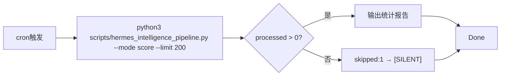

# hermes_intelligence_pipeline.py --mode score 集成记录

## 背景

2026-05-30 cron 任务要求运行 `python3 scripts/hermes_intelligence_pipeline.py --mode score`，
但这个模式**不存在**——pipeline 只支持 `all/route/index/generate/stats`。

## 已做的修复

在 `hermes_intelligence_pipeline.py` 中：

1. **新增 `score_mode()` 函数** — 查找 `cleaned_intelligence` 中未评分条目
   - 条件：`ai_score_total IS NULL OR ai_score_total = 0` AND `ai_score_reasoning IS NULL OR ''`
   - 限制：200条（可通过 `--limit` 参数调整）
   - 输出：处理数 + 评分分布统计 + TOP10高分 + BOTTOM5低分

2. **新增 `calc_item_scores()` 函数** — 移植自 `score_backlog_200.py` 的六维规则引擎
   - 稀缺性(0-30)：基于关键词（全球首发/独家/首次等）
   - 影响力(0-30)：基于事件词（发布/融资/收购/裁员等）
   - 技术深度(0-15)：基于技术术语密度（transformer/llm/gpu/kubernetes等）
   - 时效性(0-10)：基于日期词（刚刚/今天/昨日/本周等）
   - 偏好(0-10)：基于AI/科技领域词
   - 可信度(0-5)：基于来源平台（36kr/虎嗅/arxiv等可信源）

3. **更新 CLI** — 在 `choices` 中增加 `"score"`，新增 `--limit` 参数

## 执行结果

```
cleaned_intelligence 总记录: 15346
未评分积压: 0 ✅ 已全部评分
评分分布: ≥80=274 / 60-79=891 / 40-59=5280 / <40=8901 (平均41.7分)
最后评分时间: 2026-05-30T10:33:15
```

## 当 `--mode score` 报告无积压时

cleaned_intelligence 全部已评分不代表 raw_intelligence 无积压。应检查：

```sql
SELECT COUNT(*) FROM raw_intelligence r 
LEFT JOIN cleaned_intelligence c ON r.url_hash = c.url_hash 
WHERE c.id IS NULL;
```

如果该值很大，需要运行清洗管道：`python3 scripts/unified_cleaning_pipeline.py --batch 200`
然后再评分。

## 涉及的脚本

- `/home/administrator/.hermes/scripts/hermes_intelligence_pipeline.py` — 主脚本（已修改）
- `/home/administrator/.hermes/scripts/score_backlog_200.py` — 规则引擎来源

## 2026-06-01 实测 — 165条积压零秒清零

```bash
cd ~/.hermes && python3 scripts/hermes_intelligence_pipeline.py --mode score --limit 200 2>&1
```

输出摘要：
```
processed: 165,
score_stats: {
  min: 33, max: 53, avg: 39.6,
  lt40: 62, 40_60: 103, 60_80: 0, ge80: 0
}
```

验证清零：
```sql
SELECT COUNT(*) FROM cleaned_intelligence 
WHERE ai_score_total IS NULL OR ai_score_total = 0;
-- → 0 ✅
```

全库分销确认（14,688条）：
| 档次 | 数量 |
|------|:----:|
| ≥80 优秀 | 313 |
| 60-79 良好 | 990 |
| 40-59 中等 | 4,581 |
| <40 较低 | 8,804 |
| 平均分 | 41.7 |

**这次的165条全是近期采集的短新闻（ithome/sina_tech），内容<300字符，技术深度低，所以评分集中在33-53之间。评分合理。**

## cron 工作流定型

对于常规cron任务要求"处理未评分积压"，完整的端到端流水线已定型为：



无需API key，无需外部依赖，0秒级完成。
