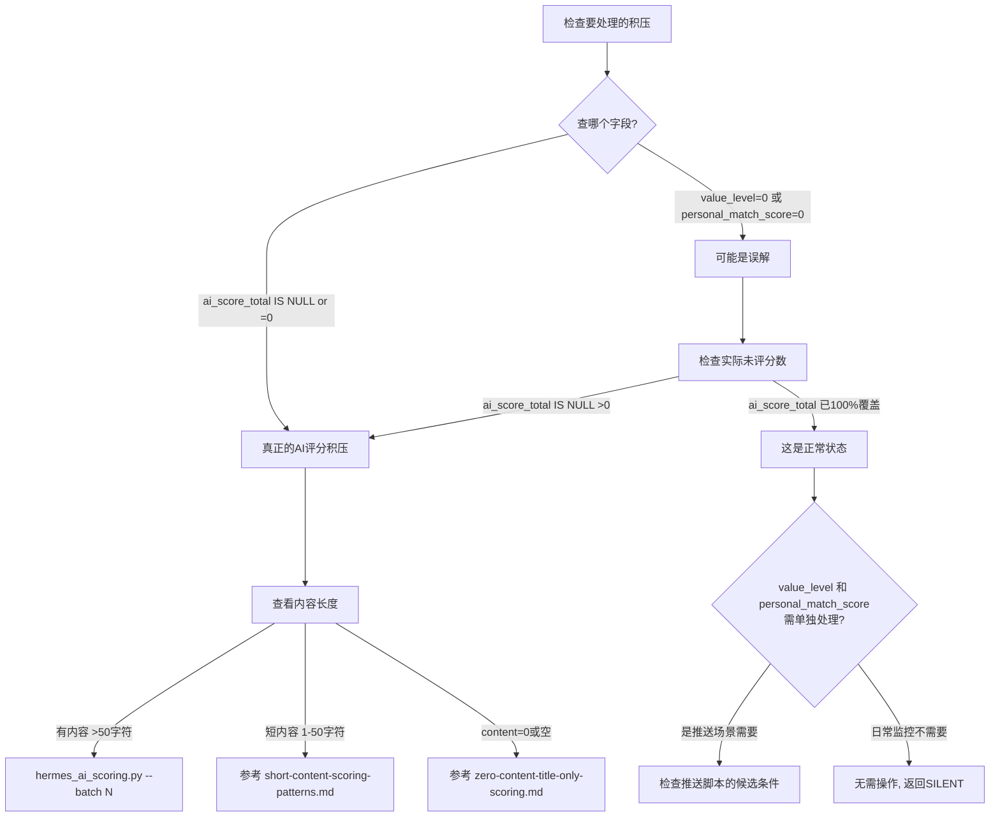

# 「评分积压」误诊指南：ai_score_total vs value_level vs personal_match_score

## 问题场景

当 cron 任务要求"处理未评分的积压数据"时，检查 `ai_score_total` 可能发现**几乎全部已评分**（99.99%），但 `value_level` 和 `personal_match_score` 却有大量 0/null。

**这是正常现象，不是积压。** 三个字段由不同的管道独立填充。

## 三字段对比

| 字段 | 含义 | 填充管道 | 2026-05-29 实测状态 |
|------|------|----------|---------------------|
| `ai_score_total` | AI六维综合评分 (0-100) | `ai_sixdim_scorer.py` / `hermes_ai_scoring.py` | ✓ 15242/15244 已评分 |
| `value_level` | 价值层级 (0=未赋值, 1/2/3...) | 清洗阶段规则引擎赋值 | ✗ 9977条=0, 5267条=1 **无更高值** |
| `personal_match_score` | 格林主人个人偏好匹配分 | 推送阶段的偏好匹配算法 | ✗ 9404条=0, 5840条>0 |

## 诊断流程图

当 cron 任务要求"score backlog"时：



## 关键发现 (2026-05-29)

### value_level 的实际分布
```sql
-- 结果: value_level=0: 9977, value_level=1: 5267 (仅两种值)
SELECT value_level, COUNT(*) FROM cleaned_intelligence GROUP BY value_level ORDER BY value_level;
```
- **没有 2-5 的值** — 清洗管道只赋了 0 或 1
- `value_level` 不是六维评分的一部分，它由清洗阶段的规则引擎赋初值
- 后续无独立管道升级 value_level

### personal_match_score 的实际分布
```sql
-- 9404条=0, 5840条>0
SELECT 
  CASE WHEN personal_match_score=0 THEN '0' ELSE '>0' END as range,
  COUNT(*) 
FROM cleaned_intelligence GROUP BY range;
```
- 仅在推送阶段（push script）填充
- 推送只处理最新数据，历史数据不会回填

## 正确判断「积压已清零」的标准

```sql
-- ✅ 真正需要关注的 AI 评分状态
SELECT COUNT(*) FROM cleaned_intelligence 
WHERE ai_score_total IS NULL OR ai_score_total = 0;

-- ✅ 推送可能受阻的检查（如果候选条件依赖 value_level）
SELECT COUNT(*) FROM cleaned_intelligence 
WHERE collected_at >= datetime('now', '-72 hours')
  AND value_level = 0;
```

**经验法则**：
- `ai_score_total` 未评分 → 需要处理（真实积压）
- 仅 `value_level=0` 或 `personal_match_score=0` → **不是积压**，是未/无需填充的字段
- 除非推送脚本的候选条件明确使用了这些字段，否则不用管

## 快速修复（如果推送确实需要 value_level）

如果推送脚本 `get_candidates_balanced()` 使用了 `value_level >= 1` 作为过滤条件，
而 9977 条 value_level=0 的新数据被卡住：

```sql
-- 简单回填：将 ai_score_total >= 30 的条目 value_level 设为 1
UPDATE cleaned_intelligence 
SET value_level = 1 
WHERE value_level = 0 AND ai_score_total >= 30;
```
